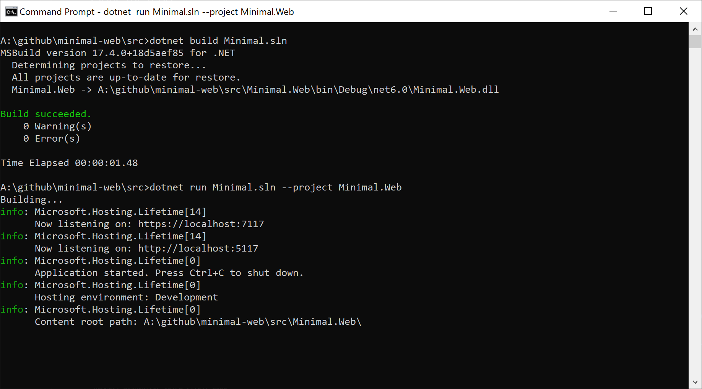
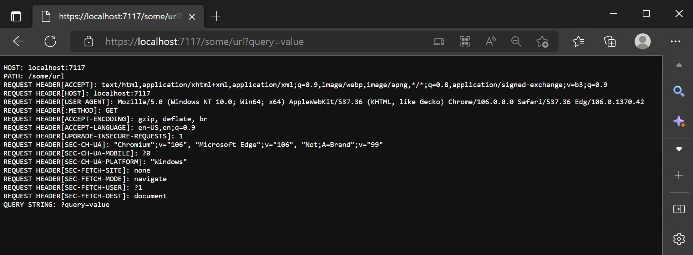
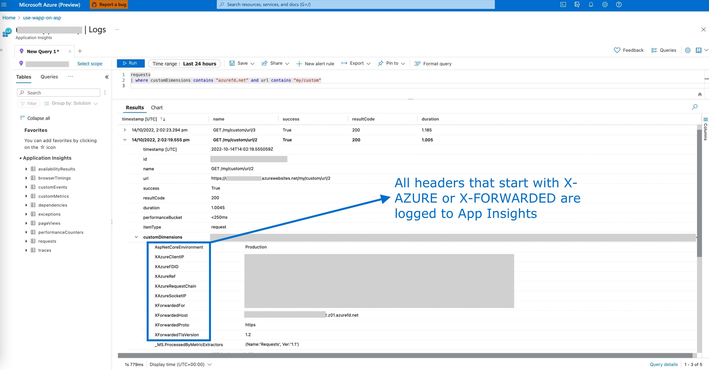

# A Minimal Web Application
This is a minimal .NET 7.0 web application that:
- Exposes health checks via the /healthz (via Microsoft.Extensions.Diagnostics.HealthChecks)
- All other requests echo the http connection, headers and query properties.
- All headers that start with X-AZURE or X-FORWARDED are logged to App Insights.

You can use this application when testing different hosting configurations.

### Demo
Try the following urls:
- https://minimal-web-demo-wapp.azurewebsites.net
- https://minimal-web-demo-wapp.azurewebsites.net/healthz
- https://minimal-web-demo-wapp.azurewebsites.net/path/to/non/existant/folder/handled/by/catch-all
- https://minimal-web-demo-wapp.azurewebsites.net/test-query-string?key1=value1&key2=value2

## How to run this sample
### Clone the repo
> git clone https://github.com/rohit-lakhanpal/minimal-web.git

### Build the solution
> cd minimal-web/src

> dotnet build Minimal.sln

### Run the project
> dotnet run Minimal.sln --project Minimal.Web

## Expected output
After navigating to the url (based on `dotnet run Minimal.sln --project Minimal.Web`) this is what you can expect.

## About the code
This minimal application is built on the ASP.NET core base template. I have additionally added the following packages:
- Microsoft.Extensions.Diagnostics.HealthChecks
- Microsoft.ApplicationInsights.AspNetCore

All the magic happens in [Program.cs](src/Minimal.Web/Program.cs)!

All headers that start with X-AZURE or X-FORWARDED are logged to App Insights. This logic is injected into the middleware pipeline via `catchAllRequestHandler` in [Program.cs](src/Minimal.Web/Program.cs). Like so:

